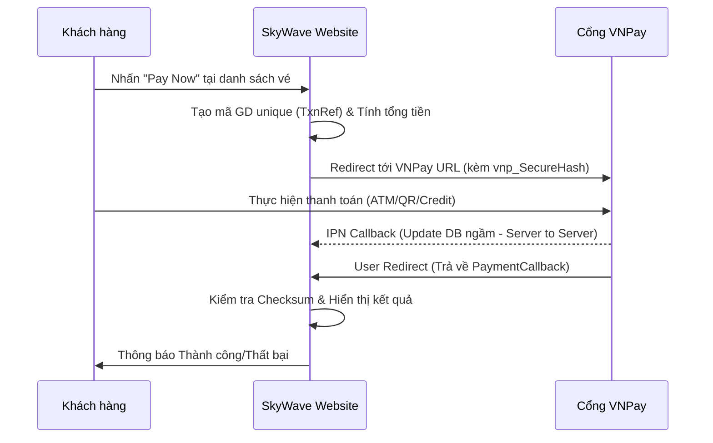

# Hướng dẫn tích hợp và sử dụng VNPay Payment

Tài liệu này cung cấp cái nhìn chi tiết về chức năng thanh toán trực tuyến qua cổng **VNPay** trong hệ thống Airline Reservation.

## 1. Tính năng (Features)

- **Thanh toán đa phương thức**: Hỗ trợ quét mã QR (VNPay-QR), thẻ ATM/Tài khoản nội địa, và các loại thẻ quốc tế (Visa/MasterCard).
- **Mã hóa bảo mật**: Sử dụng thuật toán băm **HMAC-SHA512** theo tiêu chuẩn bảo mật mới nhất của VNPay.
- **Xác thực trạng thái tin cậy (IPN)**: Cơ chế Instant Payment Notification đảm bảo trạng thái vé được cập nhật tự động ngay cả khi người dùng không quay lại website sau khi thanh toán.
- **Tự động hóa luồng nghiệp vụ**: Khi thanh toán thành công, hệ thống tự động:
  - Cập nhật trạng thái `PAID` cho cả `Booking` và `Ticket`.
  - Ghi nhận lịch sử giao dịch vào bảng `Payments`.

## 2. Luồng hoạt động (Workflow)



## 3. Cách cấu hình (Configuration)

### Cấu hình trong `appsettings.json`

Các thông số Sandbox hiện tại đã được thiết lập sẵn trong tệp `appsettings.json`:

```json
"Vnpay": {
    "TmnCode": "TQY3GNN3", 
    "HashSecret": "J8WCOFSMU9V3G7Z1Y5I5Z5I5Z5I5Z5I5",
    "BaseUrl": "https://sandbox.vnpayment.vn/paymentv2/vpcpay.html",
    "ReturnUrl": "https://localhost:7129/Payment/PaymentCallback"
}
```

- **TmnCode**: Mã Terminal ID đăng ký với VNPay.
- **HashSecret**: Chuỗi bí mật dùng để tạo chữ kýChecksum.
- **ReturnUrl**: Địa chỉ trình duyệt sẽ quay lại sau khi người dùng thanh toán xong.

## 4. Cách sử dụng (How to Use)

1.  **Đăng ký Sandbox**: Bạn có thể sử dụng thông tin thẻ test của VNPay tại trang [VNPAY Sandbox](https://sandbox.vnpayment.vn/apis/vnpay-demo/).
2.  **Thông tin thẻ test**:
    - **Ngân hàng**: NCB
    - **Số thẻ**: `9704198526191432198`
    - **Tên chủ thẻ**: `NGUYEN VAN A`
    - **Ngày phát hành**: `07/15`
    - **Mật khẩu OTP**: `123456`

## 5. Lưu ý kỹ thuật (Technical Notes)

- **Đơn vị tiền tệ**: VNPay yêu cầu giá trị thanh toán nhân với 100 (Ví dụ: `100,000 VND` sẽ gửi lên là `10,000,000`).
- **Xử lý IPN**: Đảm bảo cổng Receiver (`PaymentIPN`) của bạn có thể truy cập được từ bên ngoài (Internet) để VNPay gọi tới. Nếu chạy localhost, hãy sử dụng **Ngrok**.
- **Tính toàn vẹn**: Luộn luôn kiểm tra `vnp_SecureHash` trước khi cập nhật bất kỳ trạng thái nào trong Database để tránh tấn công thay đổi dữ liệu URL.
