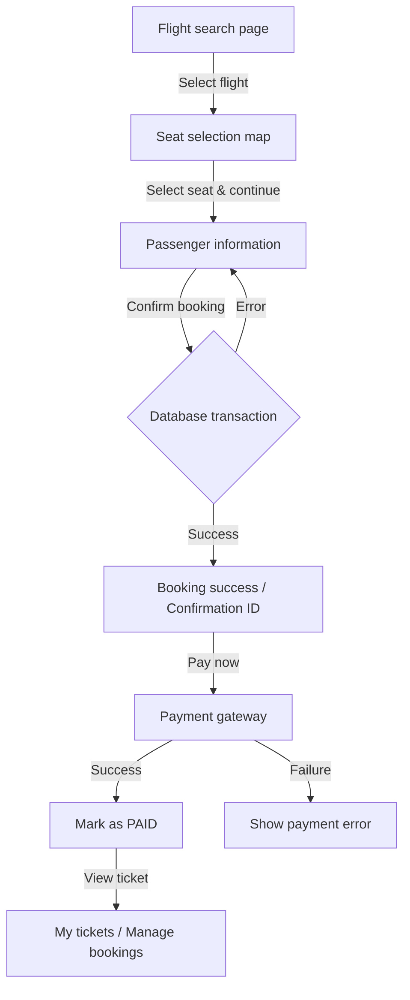

# Customer Booking Flow

This document describes the customer booking workflow and technical details for the SkyWave Airlines reservation system.

## 1. Workflow Overview

---

## 2. Detailed Steps

### Step 1: Search & Select Flight
- URL: `/Booking/BookFlight`
- Controller: `BookingController.cs`
- Description: Lists `FlightSchedule` records that are `SCHEDULED` and have a future departure time.
- Pricing note: Each flight shows a "From" price; the actual price depends on the cabin/class chosen later.

### Step 2: Interactive Seat Map
- URL: `/Booking/SelectSeat/{id}`
- Processing:
  1. The system calls `SeatService.GenerateSeatsAsync(id)` to ensure the 4-cabin seat map exists for the schedule.
  2. Query all `Seat` entities linked to the `ScheduleId`.
- 4-cabin layout:
  - First Class: Row 1 (layout 1-2-1).
  - Business Class: Rows 2-3 (layout 2-2).
  - Premium Economy: Rows 4-5 (layout 2-3-2).
  - Economy: Rows 6-10 (layout 3-3).
- Seat status:
  - AVAILABLE: selectable (green).
  - BOOKED: not selectable (coral).
  - BLOCKED: admin-locked (gray).

### Step 3: Passenger Information
- URL: `/Booking/PassengerInfo` (POST)
- ViewModel: `BookingViewModel.cs` stores `SeatId`, `ScheduleId`, and calculated price.
- Input rules:
  - Full name must match national ID or passport.
  - Passenger type: Adult / Child / Infant.
- Pricing: Price is taken from `TicketPrice` using `(ScheduleId, ClassId)`. A 10% tax is added to the total.

### Step 4: Confirmation & ACID Transaction
- Action: `ConfirmBooking` (POST) in `BookingController.cs`.
- Technical flow:
  1. Authentication: verify user is signed in.
  2. Start a database transaction (`DbTransaction`) to ensure data integrity.
  3. Consistency operations:
     - Create `Booking` with status `PENDING_PAYMENT`.
     - Create `Passenger` entries linked to the `BookingId`.
     - Create `Ticket` records linked to `BookingId`, `PassengerId`, and the specific `SeatId`.
     - Update the `Seat` status to `BOOKED` for the reserved `SeatId`.
     - Decrement `FlightSchedule.AvailableSeats` by 1.
  4. Commit the transaction if all steps succeed; otherwise rollback.

### Step 5: Booking Success
- View: `BookingSuccess.cshtml`
- Description: Shows the unique Booking ID and quick actions for payment or booking management.

---

## 3. Key Technical Components

### Controllers
- `BookingController.cs`: Orchestrates the customer 5-step booking flow.
- `AdminScheduleController.cs`: Admin seat status management (lock/unlock) and passenger details.

### Services
- `SeatService.cs`: Core logic to create the 4-cabin seat layout for new schedules.

### Models & Database
- `Seat`: Represents a physical seat for a specific flight schedule.
- `BookingViewModel`: DTO for passing data between booking steps.
- `TicketPrice`: Stores pricing per class for each schedule.

---

## 4. Important Notes
- Relational seat mapping: The system no longer stores `SeatNumber` as a plain string in `Ticket`; everything links via `SeatId` to the `Seats` table.
- Overbooking prevention: Database transactions and seat status checks prevent two users from booking the same seat concurrently.
- Admin controls: Admins can lock seats from the dashboard; the system immediately updates `SeatStatus` to prevent further bookings.

