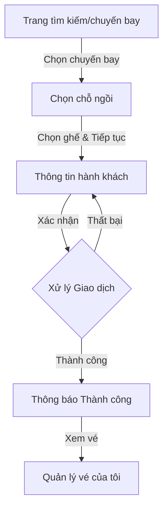

# Quy trình Đặt vé Máy bay (Customer Booking Flow)

Tài liệu này mô tả chi tiết luồng nghiệp vụ khi khách hàng thực hiện đặt vé máy bay trên hệ thống Airline.

## 1. Tổng quan Luồng Nghiệp vụ (Flowchart)

---

## 2. Chi tiết các Bước

### Bước 1: Chọn Chuyến bay (Select Flight)
- **URL**: `/Booking/BookFlight`
- **View**: `BookFlight.cshtml`
- **Mô tả**: Hiển thị danh sách các lịch trình bay (`FlightSchedule`) có trạng thái `SCHEDULED`, còn chỗ trống (`AvailableSeats > 0`) và thời gian khởi hành trong tương lai.
- **Dữ liệu hiển thị**: Điểm đi, điểm đến, giờ bay, số hiệu chuyến bay, giá vé và số lượng ghế còn lại.

### Bước 2: Chọn Chỗ ngồi (Select Seat)
- **URL**: `/Booking/SelectSeat/{id}`
- **View**: `SelectSeat.cshtml`
- **Mô tả**: Hiển thị sơ đồ ghế ngồi (Seat Map) của tàu bay.
- **Trạng thái ghế**:
    - **Trống (Available)**: Có thể chọn.
    - **Đã chọn (Selected)**: Ghế đang được người dùng click chọn.
    - **Đã đặt (Occupied)**: Ghế đã có người khác đặt thành công.
    - **Bị khóa (Blocked)**: Ghế không khả dụng do yêu cầu kỹ thuật hoặc hành chính.

### Bước 3: Thông tin Hành khách (Passenger Information)
- **URL**: `/Booking/PassengerInfo` (POST)
- **View**: `PassengerInfo.cshtml`
- **Dữ liệu cần nhập**:
    - **Họ và tên**: Theo giấy tờ tùy thân (CCCD/Passport).
    - **Loại hành khách**: Người lớn (Adult), Trẻ em (Child), Trẻ sơ sinh (Infant).
- **Tóm tắt đơn hàng**: Hiển thị lại số hiệu chuyến bay, số ghế đã chọn và tổng giá tiền.

### Bước 4: Xác nhận và Lưu trữ (Confirm & Process)
- **Action**: `ConfirmBooking` (POST) trong `BookingController`
- **Xử lý kỹ thuật**: Sử dụng `Database Transaction` để đảm bảo tính toàn vẹn dữ liệu:
    1. Kiểm tra đăng nhập (Authentication).
    2. Kiểm tra lại sự khả dụng của ghế (Double Check).
    3. Tạo bản ghi `Booking`.
    4. Tạo bản ghi `Passenger`.
    5. Tạo bản ghi `Ticket` (trạng thái `ACTIVE`).
    6. Trừ số lượng ghế trống (`AvailableSeats`) trong `FlightSchedule`.
    7. Commit giao dịch (hoặc Rollback nếu có lỗi).

### Bước 5: Hoàn tất (Booking Success)
- **View**: `BookingSuccess.cshtml`
- **Mô tả**: Thông báo đặt vé thành công và cung cấp mã đặt chỗ (Booking ID). Người dùng có thể chuyển đến trang quản lý vé hoặc in vé.

---

## 3. Các Thành phần Kỹ thuật Chính

- **Controller**: `BookingController.cs` (Chịu trách nhiệm điều phối luồng).
- **Model**: `BookingViewModel.cs` (Chứa dữ liệu trung gian trong quá trình đặt vé).
- **Database Tables**:
    - `FlightSchedules`: Lưu thông tin chuyến bay, giờ bay, số ghế trống.
    - `Bookings`: Lưu thông tin chung về đơn hàng và người đặt.
    - `Passengers`: Lưu thông tin chi tiết từng hành khách.
    - `Tickets`: Lưu thông tin vé gắn với chỗ ngồi và loại vé.

---

## 4. Lưu ý quan trọng
- Hệ thống hiện tại yêu cầu người dùng phải **Đăng nhập** trước khi nhấn "Xác nhận đặt vé".
- Giá vé hiện đang được đặt cố định là **1.500.000 VND** (Logic này có thể được mở rộng linh hoạt theo hạng vé - TicketClass sau này).
