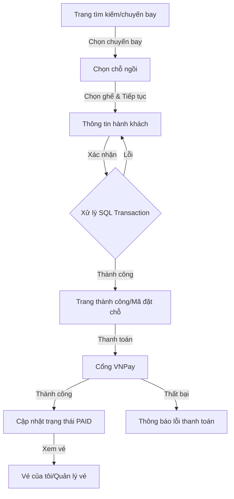

# Quy trình Đặt vé Máy bay (Customer Booking Flow)

Tài liệu này mô tả chi tiết luồng nghiệp vụ khi khách hàng thực hiện đặt vé máy bay trên hệ thống Airline.

## 1. Tổng quan Luồng Nghiệp vụ (Flowchart)

---

## 2. Chi tiết các Bước

### Bước 1: Chọn Chuyến bay (Select Flight)
- **URL**: `/Booking/BookFlight`
- **View**: `BookFlight.cshtml`
- **Mô tả**: Hiển thị danh sách các lịch trình bay (`FlightSchedule`) có trạng thái `SCHEDULED`, còn chỗ trống (`AvailableSeats > 0`) và thời gian khởi hành trong tương lai.
- **Dữ liệu hiển thị**: Điểm đi, điểm đến, giờ bay, số hiệu chuyến bay, giá vé và số lượng ghế còn lại.

### Bước 2: Chọn Chỗ ngồi (Select Seat)
- **URL**: `/Booking/SelectSeat/{id}`
- **View**: `SelectSeat.cshtml`
- **Mô tả**: Hiển thị sơ đồ ghế ngồi (Seat Map) của tàu bay.
- **Trạng thái ghế**:
    - **Trống (Available)**: Có thể chọn.
    - **Đã chọn (Selected)**: Ghế đang được người dùng click chọn.
    - **Đã đặt (Occupied)**: Ghế đã có người khác đặt thành công.
    - **Bị khóa (Blocked)**: Ghế không khả dụng do yêu cầu kỹ thuật hoặc hành chính.

### Bước 3: Thông tin Hành khách (Passenger Information)
- **URL**: `/Booking/PassengerInfo` (POST)
- **View**: `PassengerInfo.cshtml`
- **ViewModel**: `BookingViewModel.cs` mang các thông tin từ các bước trước chuyển sang (ScheduleId, SeatNumber, Price, FlightNumber...).
- **Dữ liệu cần nhập thêm**:
    - **Họ và tên**: Tên đầy đủ trên căn cước/hộ chiếu.
    - **Loại hành khách**: Phân loại Adult/Child/Infant để tính giá vé sau này.
- **Mục tiêu**: Chuẩn bị đầy đủ `BookingViewModel` trước khi gửi lên `ConfirmBooking`.

### Bước 4: Xác nhận và Lưu trữ (Confirm & Process)
- **Action**: `ConfirmBooking` (POST) trong `BookingController.cs`
- **Phân tích chi tiết quy trình xử lý**:
    1. **Kiểm tra Xác thực**: Yêu cầu người dùng (Customer) phải đăng nhập. Mã đăng nhập `userId` được lấy từ `ClaimTypes.NameIdentifier`.
    2. **Khởi tạo SQL Transaction**: Sử dụng `_context.Database.BeginTransactionAsync()` để đảm bảo tính **Atomicity**. Nếu bất kỳ bước nào thất bại, toàn bộ quá trình sẽ được Rollback, tránh tình trạng dữ liệu mồ côi (ví dụ: tạo Booking nhưng không tạo được Ticket).
    3. **Kiểm tra Availability (Chống Overbooking)**:
        - Hệ thống thực hiện một lượt kiểm tra cuối cùng trong Database: `schedule.AvailableSeats > 0`.
        - Điều này ngăn chặn trường hợp hai khách hàng cùng chọn một chuyến bay vào cùng một thời điểm nhưng chỉ còn 1 chỗ trống cuối cùng.
    4. **Quy trình Lưu trữ 4 Giai đoạn**:
        - **GĐ1 (Booking)**: Lưu thông tin đặt chỗ chung. Trạng thái mặc định là `CONFIRMED`.
        - **GĐ2 (Passenger)**: Lưu thông tin chi tiết người bay gắn với `BookingId`.
        - **GĐ3 (Ticket)**: Tạo vé máy bay gắn với `BookingId`, `PassengerId` và `SeatNumber`. Trạng thái mặc định là `ACTIVE`.
        - **GĐ4 (Update Capacity)**: Trừ đi 1 ghế trống trong `FlightSchedules`.
    5. **Commit Giao dịch**: Nếu tất cả các bước trên thành công, giao dịch được xác nhận (Commit) vào Database.

### Bước 5: Hoàn tất (Booking Success)
- **View**: `BookingSuccess.cshtml`
- **Mô tả**: Thông báo đặt vé thành công và cung cấp mã đặt chỗ (Booking ID).
- **Trạng thái lúc này**: `Booking: CONFIRMED`, `Ticket: ACTIVE`. Ghế đã được giữ chỗ thành công trong hệ thống.

### Bước 6: Thanh toán (Payment Integration)
- **Controller**: `PaymentController.cs`
- **Action**: `CreatePayment(id)`
- **Quy trình**:
    1. Người dùng nhấn nút "Thanh toán" hoặc được chuyển từ trang xem chi tiết vé.
    2. Hệ thống tính tổng tiền từ `TicketPrices` (dựa trên `ScheduleId` và `ClassId`).
    3. Tạo URL thanh toán VNPay với các tham số tương ứng (Số tiền, Mã đơn hàng, URL trả về).
    4. Sau khi khách hàng thanh toán tại VNPay, `PaymentCallback` xử lý kết quả:
        - Nếu thành công: Cập nhật `Booking.Status = "PAID"`, `Ticket.Status = "PAID"`, tạo bản ghi `Payment`.
        - Nếu thất bại: Hiển thị thông báo lỗi, giữ trạng thái `CONFIRMED` để thanh toán lại sau.

---

## 3. Các Thành phần Kỹ thuật Chính

- **Controllers**:
    - `BookingController.cs`: Điều phối luồng đặt vé chính.
    - `PaymentController.cs`: Xử lý tích hợp thanh toán VNPay và cập nhật trạng thái đơn hàng.
    - `TicketController.cs`: Quản lý danh sách vé của khách hàng (`MyTickets`).
- **Models**:
    - `BookingViewModel.cs`: Chứa dữ liệu tạm thời (`DTO`) để truyền giữa các View/Action.
    - `DataContext.cs`: Entity Framework context định nghĩa các bảng và mối quan hệ.
- **Database Tables**:
    - `FlightSchedules`: Quản lý chuyến bay cụ thể, giờ bay và **AvailableSeats**.
    - `Bookings`: Header của đơn hàng, lưu `UserId` và `Status` (CONFIRMED/PAID/CANCELLED).
    - `Passengers`: Chứa tên và phân loại hành khách.
    - `Tickets`: Chi tiết từng vé, lưu `SeatNumber` và `ClassId`.
    - `Payments`: Lưu lịch sử giao dịch thành công từ VNPay (`TransactionNo`, `Amount`).

---

## 4. Lưu ý quan trọng
- **Quy trình Trạng thái (Status Flow)**: 
    - `Booking`: `CONFIRMED` (Sau khi đặt) -> `PAID` (Sau khi thanh toán thành công).
    - `Ticket`: `ACTIVE` (Mặc định) -> `PAID` (Nếu thanh toán thành công).
- **Tính toàn vẹn**: Toàn bộ quy trình `ConfirmBooking` được bọc trong `SQL Transaction`. Nếu có lỗi (như mất kết nối DB), hệ thống sẽ không trừ ghế ảo.
- **Thanh toán**: Hiện tại tích hợp cổng thanh toán VNPay. Nếu khách hàng không thanh toán ngay, vé vẫn được giữ ở trạng thái `CONFIRMED`. Admin có thể hủy các vé quá hạn thanh toán sau một khoảng thời gian quy định.
